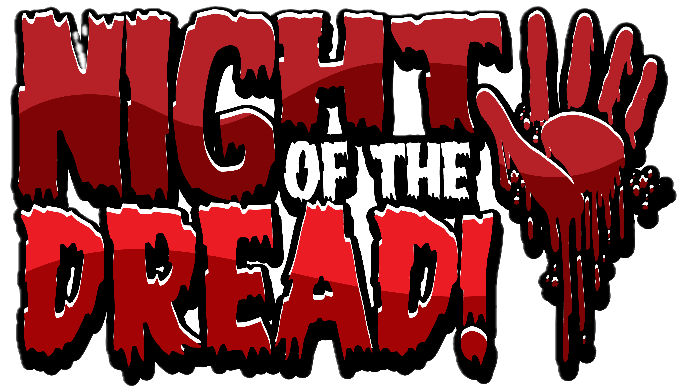
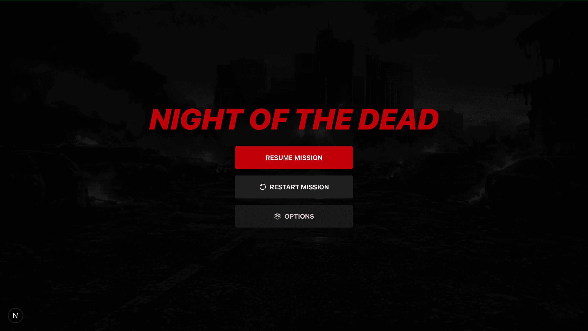
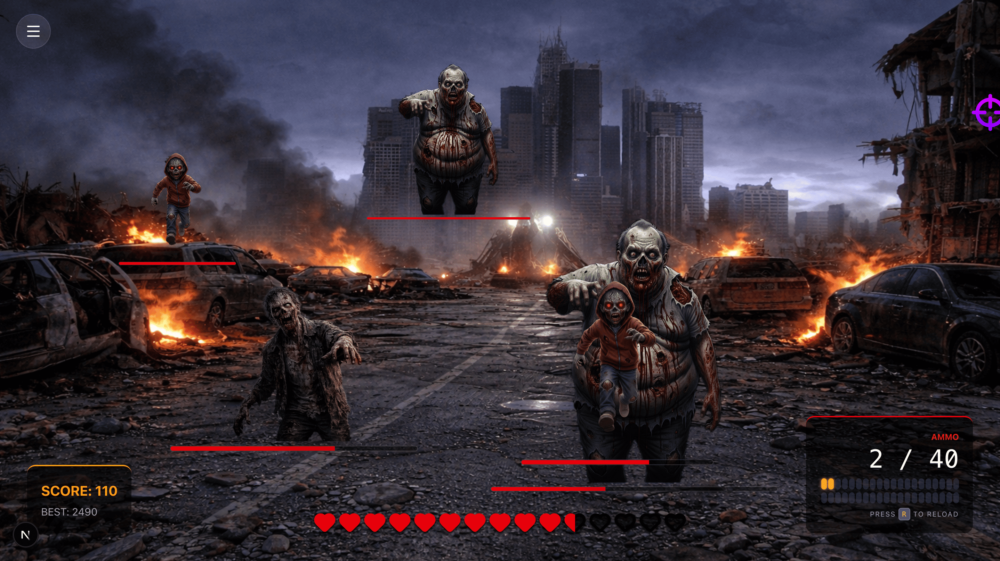
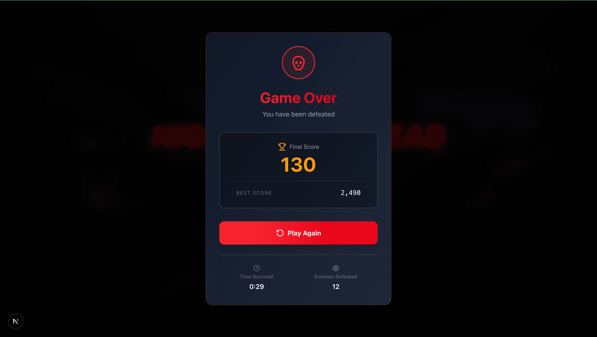
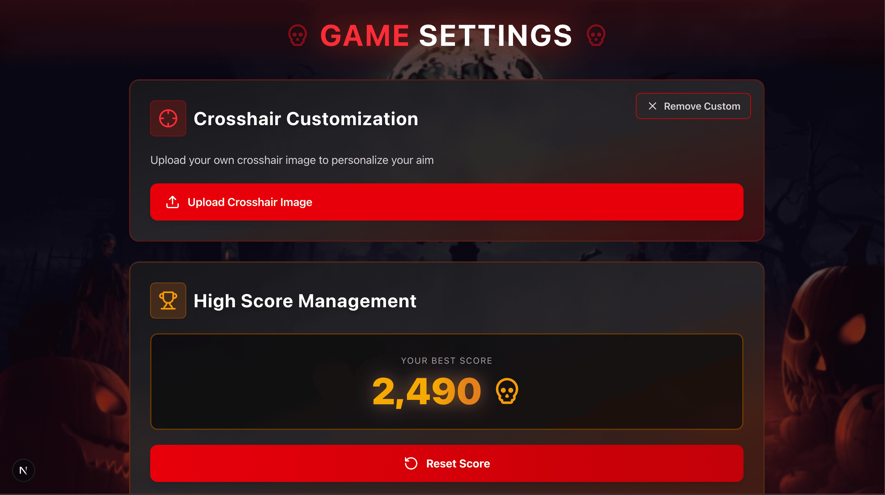

# Night Of The DEAD



**Night Of The DEAD** is a lightweight, addictive web-based arcade shooter where your mouse is your only weapon. As the screen fills with the undead, you must aim and click to survive. How long can you last before the horde takes over?

## Game Overview

Experience intense zombie survival action right in your browser. Armed with only your mouse and quick reflexes, face waves of the undead as they close in from all sides. Each click counts, each second matters.

## Key Features

- **Precision Aiming**: Custom crosshair mechanics mapped to mouse movement for pixel-perfect accuracy
- **Persistent Scoring**: Local storage integration to save your personal best and track your survival records
- **Desktop Optimized**: Built specifically for desktop browsers for the best gaming experience
- **Multiple Zombie Types**:
  - Fast Zombies: Quick and agile, they'll close the distance before you know it
  - Normal Zombies: Standard undead with balanced speed and health
  - Tank Zombies: Slow but heavily armored, requiring multiple shots to take down
- **Health System**: Start with 10 hearts - survive as long as you can before the horde overwhelms you
- **FPS-Style Perspective**: Immersive first-person view with zombies approaching from the front

## ScreenShots

### Game Menu



### Game Play



### Game Over



### Settings or Options



## Getting Started

### Prerequisites

- A modern web browser (Chrome, Firefox, Edge, Safari)
- Desktop/Laptop computer for optimal experience

## How to Play

1. **Aim**: Move your mouse to aim the crosshair at approaching zombies
2. **Shoot**: Click to fire and eliminate zombies
3. **Survive**: Prevent zombies from reaching you - each hit costs you one heart
4. **Score**: Rack up points by eliminating as many zombies as possible
5. **Beat Your Best**: Try to beat your high score saved in local storage

### Controls

- **Mouse Movement**: Aim crosshair
- **Left Click**: Shoot
- **ESC**: Pause game

## Zombie Types

| Type          | Speed  | Health | Points   |
| ------------- | ------ | ------ | -------- |
| Fast Zombie   | High   | Low    | Medium   |
| Normal Zombie | Medium | Medium | Standard |
| Tank Zombie   | Low    | High   | High     |

## Scoring System

- Fast Zombie Kill: +10 points
- Normal Zombie Kill: +5 points
- Tank Zombie Kill: +20 points

## Technologies Used

- **Next.js 14**: React framework with App Router for structure and routing
- **Tailwind CSS**: Utility-first styling and animations
- **React Hooks**: Game logic, state management, and interactivity
- **LocalStorage API**: Score persistence (client-side)

## Project Structure

```
night-of-the-dead/
├── src/app/                    # Main game Folder
|   ├── settings                # Options / User Settings
|   ├── globals.css             # Vanilla Css
|   ├── layout.js               # Layout
|   ├── page.js                 # Main Game
|   └── DesktopOnlyWrapper.js   # Desktop only Device Wrapper
├── README.md                   # This file
└── public/assets/              # Game assets
    ├── brandname.png           # BrandName Image
    ├── images/                 # Zombie sprites, backgrounds
    └── sounds/                 # Sound effects
```

## Known Issues

- Game is optimized for desktop only - mobile support coming soon
- Performance may vary on older browsers

## Future Enhancements

- [ ] Mobile/touch support
- [ ] Power-ups and special weapons
- [ ] Multiple difficulty levels
- [ ] Leaderboard system
- [ ] Achievement badges
- [ ] Different environment themes
- [ ] Boss zombies

## Contributing

This is an academic project created for educational purposes. Feel free to fork, modify, and experiment with the code for your own learning!

## Academic Purpose

This project was created for academic and educational purposes to demonstrate:

- Interactive web game development
- Event-driven programming
- Game state management
- LocalStorage implementation
- CSS cursor customization

## Author

Created as part of a web development learning project.

## Acknowledgments

- Inspired by classic zombie survival games
- Built with passion for web-based gaming
- Thanks to the web development community for resources and inspiration

---

**⚠️ Note**: This is an academic project and not production-ready software. Use for educational purposes and personal learning.
